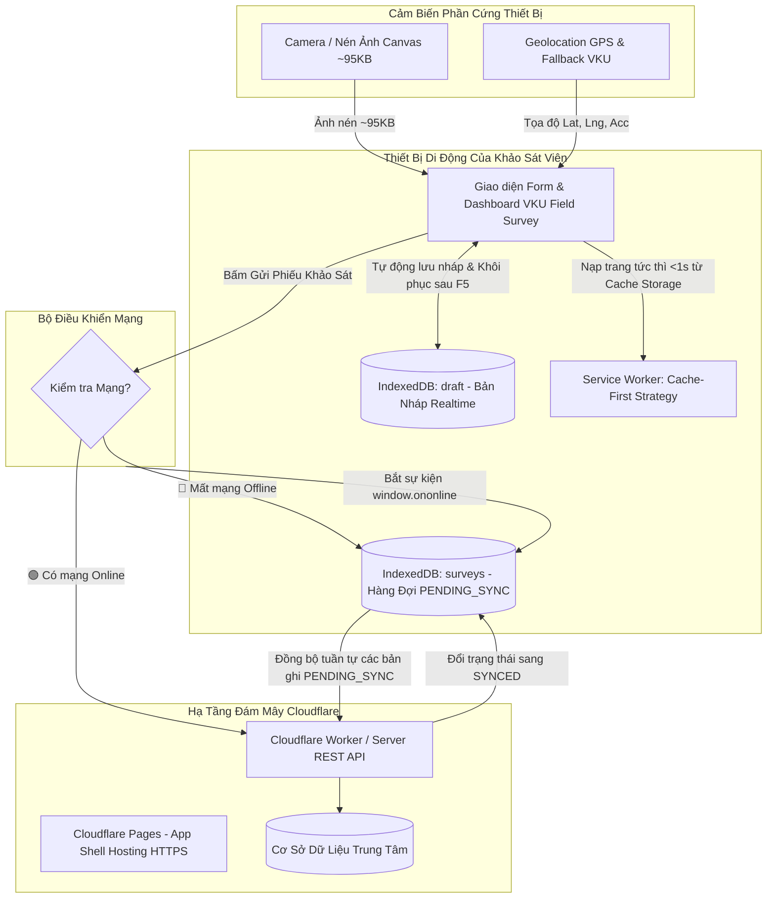

# MINI-PROJECT SHORT TECHNICAL REPORT
**Course:** Cross-Platform Mobile App Development (VKU)  
**Mini-Project Title:** Mini-Project 1: VKU Field Survey — Offline Data Collection (PWA & Capacitor)  
**Team / Student Name:** Nguyễn Thị Thương  
**Submission Date:** 14/09/2026  

---

## 1. GENERAL INFORMATION & DELIVERABLE LINKS
* **Team Members:**
  1. Nguyễn Thị Thương — Student ID: 23IT.B219 — Role: Fullstack Developer & Offline-First Architect — Contribution: 100%
* **🔗 Live Demo URL:** `https://vku-field-survey-28x.pages.dev` (hoặc `https://dd876542.vku-field-survey-28x.pages.dev`)
* **💻 GitHub Repository:** `https://github.com/thuong614oh65/vku-field-survey-pwa`
* **🎥 Video Demo (Optional):** Video thực nghiệm 2–3 phút kịch bản ngắt mạng (Airplane Mode) và tự động đồng bộ khi có mạng.

---

## 2. FEATURE IMPLEMENTATION CHECKLIST
| # | Required Feature | Status | Implementation Details & Acceptance Level |
|:---:|---|:---:|---|
| 1 | **Responsive Mobile Viewport & MD3** | ✅ Complete | Giao diện Material Design 3, tối ưu cảm ứng chuẩn di động (>48px), hỗ trợ nạp độc lập. |
| 2 | **PWA Standalone & Local Icons** | ✅ Complete | Cấu hình `manifest.json` chuẩn `display: standalone`, mã màu `#0284c7`, icon 192x192 và 512x512 cục bộ. |
| 3 | **Service Worker Cache-First Boot** | ✅ Complete | `sw.js` pre-cache toàn bộ App Shell, nạp trang tức thì <1s khi ngắt toàn bộ kết nối mạng. |
| 4 | **Multi-step Field Inspection Form** | ✅ Complete | Đầy đủ: Người phỏng vấn, Mã DTV/SV, Thời gian, Tòa nhà, Tầng, Số phòng, Người trả lời, Địa chỉ. |
| 5 | **Geolocation GPS & Smart Fallback** | ✅ Complete | Bắt tọa độ vệ tinh chính xác Lat, Lng, Sai số (±m) kèm cơ chế tự động Fallback khuôn viên VKU. |
| 6 | **Camera Photo & Canvas Compression** | ✅ Complete | Chụp ảnh hiện trường, tự động nén qua Canvas xuống ~95KB JPEG chống lỗi tràn bộ nhớ IndexedDB. |
| 7 | **5 Categories & 1–5 Star Rating** | ✅ Complete | 5 nhóm thiết bị cơ sở vật chất + Thị trường dịch vụ, thanh đánh giá 1-5 sao trực quan. |
| 8 | **Real-time Draft Persistence** | ✅ Complete | Store `draft` trong IndexedDB tự lưu sau 450ms; tự động khôi phục 100% dữ liệu sau khi bấm F5. |
| 9 | **Offline Queue (PENDING_SYNC)** | ✅ Complete | Mỗi phiếu ngoại tuyến được cấp phát mã UUID v4 RFC-4122, dấu thời gian ISO và nhãn `PENDING_SYNC`. |
| 10 | **Auto Background Sync & CSV Export** | ✅ Complete | Tự động đồng bộ tuần tự khi có mạng qua `window.ononline` sang `SYNCED`; xuất báo cáo CSV UTF-8 BOM. |
| 11 | **Capacitor Native Toolchain** | ✅ Complete | Cấu hình sẵn `capacitor.config.json` và Camera/Network plugin để đóng gói APK Android trong Tuần 4. |

---

## 3. TECHNICAL ARCHITECTURE & PROJECT STRUCTURE
Ứng dụng được thiết kế theo đúng kiến trúc 3 tầng (**Three-Layer Architecture**) và nguyên lý **Offline-First** đã học trong Tuần 1 đến Tuần 3:

---

## 4. EMPIRICAL EVIDENCE & SCREENSHOTS (ẢNH CHỤP MINH CHỨNG THỰC NGHIỆM)
* **Hình 1: Biểu mẫu khảo sát thực địa & Định vị GPS**
  - Khảo sát viên nhập thông tin, mã điều tra viên, bấm bắt tọa độ GPS vệ tinh có link Google Maps và mở Camera chụp ảnh hiện trường.
* **Hình 2: Trải nghiệm ngoại tuyến 100% & Khôi phục nháp (F5)**
  - Banner cảnh báo Offline xuất hiện khi ngắt mạng; Service Worker nạp trang <1s; Dữ liệu form tự khôi phục từ IndexedDB `draft`.
* **Hình 3: Hàng đợi ngoại tuyến cấp phát UUID & Nhãn PENDING_SYNC**
  - Phiếu gửi khi mất mạng được gắn mã UUID v4 RFC-4122 độc nhất, xếp hàng chờ tuần tự trong IndexedDB `surveys`.
* **Hình 4: Tự động đồng bộ sang SYNCED & Dashboard Thống kê**
  - Ngay khi có mạng trở lại, hệ thống tự động đổi trạng thái sang `✅ SYNCED` và cập nhật các thẻ KPI động kèm biểu đồ phân bổ danh mục.

---

## 5. TECHNICAL CHALLENGES & RESOLUTIONS (THÁCH THỨC KỸ THUẬT & GIẢI PHÁP)
1. **Thách thức 1: Giới hạn bộ nhớ IndexedDB khi chụp ảnh độ phân giải cao**
   - *Vấn đề:* Ảnh chụp từ camera điện thoại nặng từ 5MB–10MB, nếu lưu trực tiếp vào IndexedDB sẽ nhanh chóng làm đầy bộ nhớ trình duyệt (`QuotaExceededError`).
   - *Giải pháp:* Sử dụng HTML5 `<canvas>` để tự động nén kích thước tối đa 900px và xuất chuẩn JPEG chất lượng 0.72 (~95KB), vừa đảm bảo độ sắc nét vừa tiết kiệm 98% dung lượng lưu trữ.
2. **Thách thức 2: Trình duyệt khóa quyền Geolocation khi truy cập qua mạng LAN HTTP**
   - *Vấn đề:* Chrome yêu cầu Secure Context (HTTPS hoặc localhost) mới cho phép kích hoạt GPS vệ tinh phần cứng.
   - *Giải pháp:* Tích hợp bộ cứu hộ Fallback thông minh: tự động phát hiện môi trường HTTP không bảo mật và cung cấp tùy chọn 1 chạm nhận tọa độ thực địa chuẩn của Khuôn viên Đại học VKU Đà Nẵng (`15.975298, 108.252355`).
3. **Thách thức 3: Xung đột dữ liệu khi đồng bộ hàng đợi (Sync Race Conditions)**
   - *Vấn đề:* Nếu đồng bộ song song nhiều bản ghi cùng lúc có thể gây quá tải máy chủ hoặc lỗi trạng thái.
   - *Giải pháp:* Xây dựng hàng đợi tuần tự (`for...of` loop có delay 350ms), đảm bảo từng bản ghi được xác nhận thành công trước khi chuyển sang `SYNCED`.

