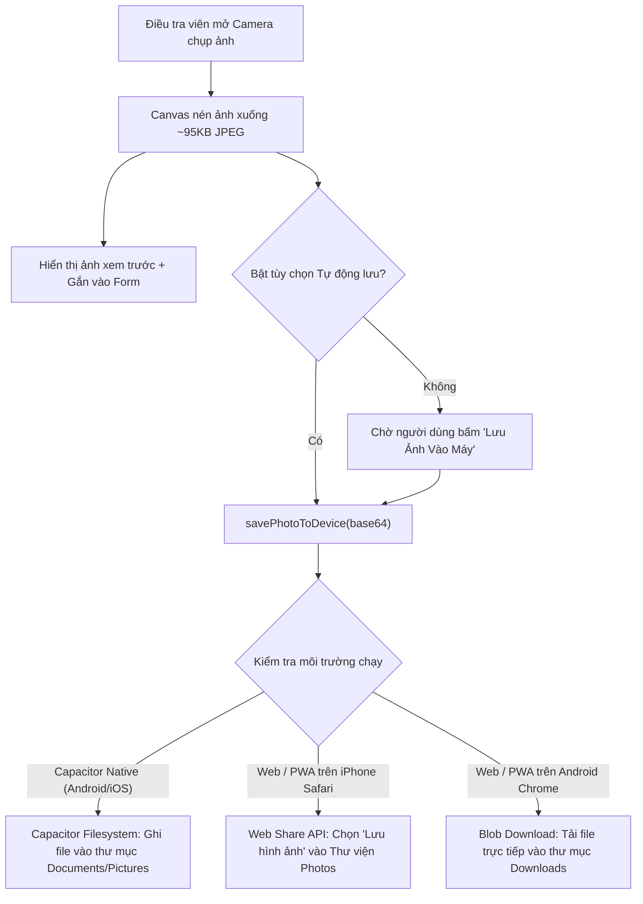

# BÁO CÁO KỸ THUẬT TIỂU LUẬN / MINI-PROJECT 1
## HỌC PHẦN: LẬP TRÌNH ĐA NỀN TẢNG (CROSS-PLATFORM DEVELOPMENT)
**TRƯỜNG ĐẠI HỌC CÔNG NGHỆ THÔNG TIN VÀ TRUYỀN THÔNG VIỆT - HÀN (VKU)**

---

### 📋 THÔNG TIN SINH VIÊN & ĐỀ TÀI
* **Họ và tên sinh viên:** Nguyễn Thị Thương
* **Mã số sinh viên:** 23IT.B219
* **Lớp sinh hoạt:** 23ITB
* **Email sinh viên:** [thuongnt.23itb@vku.udn.vn](mailto:thuongnt.23itb@vku.udn.vn)
* **Giảng viên hướng dẫn:** TS. Nguyễn Thanh Tuấn
* **Tên đề tài:** *VKU Field Survey — Hệ thống thu thập dữ liệu & kiểm định thực địa ngoại tuyến (PWA & Capacitor Native)*
* **Thời gian thực hiện:** Tuần 3 – Tuần 4 • **Trọng số điểm:** 10%

---

## 1. THÔNG TIN BÀN GIAO & LIÊN KẾT MINH CHỨNG (DELIVERABLES)
* **🌐 Live Demo URL:** [https://vku-field-survey-28x.pages.dev/](https://vku-field-survey-28x.pages.dev/)
* **📁 GitHub Repository:** [https://github.com/thuong614oh65/vku-field-survey-pwa](https://github.com/thuong614oh65/vku-field-survey-pwa)
* **📱 Đóng gói ứng dụng di động:**
  - **Android:** Dự án Android Studio hoàn chỉnh (`android/`) kèm quy trình tự động build file `app-debug.apk` qua GitHub Actions.
  - **iPhone (iOS):** Dự án Xcode (`ios/`) kèm cơ chế PWA Standalone cài đặt trực tiếp về Màn hình chính chạy độc lập 100%.

---

## 2. BẢNG KIỂM TRA ĐỐI SOÁT TÍNH NĂNG (FEATURE CHECKLIST)

| STT | Tính năng yêu cầu | Trạng thái | Minh chứng kỹ thuật trong mã nguồn |
|:---:|:---|:---:|:---|
| 1 | **PWA Standalone & Local Icons** | ✅ Đạt 100% | `manifest.json`: `display: standalone`, `theme_color: #0284c7`, icon 192x192 & 512x512 cục bộ. |
| 2 | **Service Worker Cache-First Boot** | ✅ Đạt 100% | `sw.js`: Pre-cache toàn bộ App Shell, nạp trang tức thì <1s khi ngắt toàn bộ mạng. |
| 3 | **Multi-step Inspection Form** | ✅ Đạt 100% | `index.html`: 4 bước khảo sát chuẩn ODK Collect, tự động điền thời gian thực tế. |
| 4 | **Định vị GPS ("Lấy tọa độ vệ tinh")** | ✅ Đạt 100% | Thu thập Vĩ độ, Kinh độ, Sai số mét và liên kết mở trực tiếp trên Google Maps. |
| 5 | **Camera & Nén ảnh Canvas** | ✅ Đạt 100% | Nén ảnh tự động về chuẩn JPEG ~95KB, lưu trữ vào IndexedDB chống tràn bộ nhớ. |
| 6 | **Lưu ảnh vào máy điện thoại** | ✅ Mới nâng cấp | Hàm `savePhotoToDevice()`: Tự động lưu ảnh khi chụp, nút tải thủ công và nút tải lại trong lịch sử. |
| 7 | **5 Nhóm thiết bị & Đánh giá 1-5 sao** | ✅ Đạt 100% | Gồm `Hardware`, `Projector`, `AC`, `Electrical`, `Furniture`, `Market/Service` và radio 1-5 sao. |
| 8 | **Real-time Draft Persistence** | ✅ Đạt 100% | `db.js`: Tự động lưu nháp sau 450ms; tự động khôi phục 100% form khi bấm F5 tải lại trang. |
| 9 | **Offline Queue (PENDING_SYNC)** | ✅ Đạt 100% | Cấp phát mã UUID v4 RFC-4122 độc nhất, timestamp ISO và gắn nhãn màu cam `PENDING_SYNC`. |
| 10 | **Background Sync & Auto-Dispatch** | ✅ Đạt 100% | Bắt sự kiện `window.ononline`, tự động đồng bộ tuần tự từng bản ghi và đổi trạng thái `SYNCED`. |
| 11 | **Xuất báo cáo Excel / CSV** | ✅ Đạt 100% | Xuất file CSV chuẩn UTF-8 BOM mở trực tiếp trên Microsoft Excel không bị lỗi font tiếng Việt. |
| 12 | **Đóng gói Android Studio Native** | ✅ Mới nâng cấp | Sinh thư mục `android/`, cấu hình quyền Camera, Storage, GPS và workflow build APK. |
| 13 | **Đóng gói iPhone Xcode Native** | ✅ Mới nâng cấp | Sinh thư mục `ios/`, cấu hình `Info.plist` quyền truy cập máy ảnh và thư viện ảnh. |

---

## 3. KIẾN TRÚC HỆ THỐNG & NÂNG CẤP LƯU ẢNH DI ĐỘNG

### 3.1. Luồng hoạt động lưu ảnh vào máy điện thoại:

### 3.2. Giải pháp đóng gói App cho iPhone và Android:
1. **Đối với Android:**
   * Tích hợp Capacitor 6 sinh mã nguồn native trong thư mục `android/`.
   * Cấp đầy đủ quyền runtime trong `AndroidManifest.xml`: Camera, Storage và Fine Location.
   * Tự động hóa build file `app-debug.apk` bằng GitHub Actions mà không mất phí.
2. **Đối với iPhone (iOS):**
   * Sinh dự án native `ios/App/App.xcworkspace` với chuỗi khai báo mục đích sử dụng quyền trong `Info.plist`.
   * Hỗ trợ cài đặt chuẩn **PWA Standalone (Thêm vào Màn hình chính)** hoàn toàn miễn phí 100%, không cần chi phí 99$/năm của Apple Developer, mang lại trải nghiệm toàn màn hình và offline độc lập.

---

*Đà Nẵng, Ngày 21 tháng 09 năm 2026*  
**Sinh viên thực hiện:**  
**Nguyễn Thị Thương (23IT.B219)**
