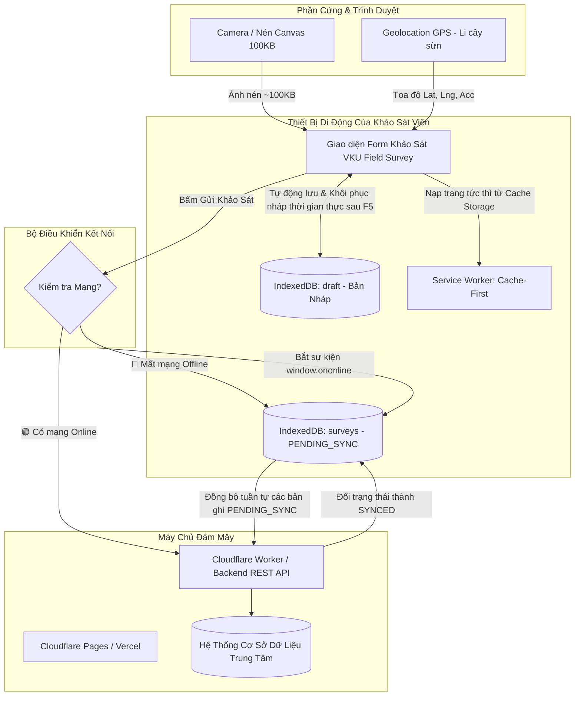

# MINI-PROJECT 1: VKU FIELD SURVEY — OFFLINE DATA COLLECTION (PWA & CAPACITOR)

**Học phần:** Lập trình ứng dụng di động đa nền tảng (Cross-Platform Mobile App Development)  
**Thời lượng:** Tuần 3 – Tuần 4 | **Trọng số:** 10% điểm tổng kết  
**Đơn vị:** Khoa Khoa học Máy tính — Trường Đại học Công nghệ Thông tin và Truyền thông Việt - Hàn (VKU)  
**Mô hình thiết kế chuẩn:** ODK Collect & VKU Campus Facility Field Survey  

---

## 🎯 1. TỔNG QUAN DỰ ÁN & VẤN ĐỀ CẦN GIẢI QUYẾT (PROBLEM SCENARIO)
Cán bộ kiểm định cơ sở vật chất và sinh viên điều tra thực địa tại trường VKU thực hiện khảo sát hiện trường các phòng học, phòng máy tính Lab, máy chiếu, điều hòa và hệ thống điện tại các khu vực tầng hầm, các dãy nhà xa (Khu A, Khu B, Khu C, Khu V, Ký túc xá, Khu dịch vụ) — nơi **hoàn toàn mất sóng Wi-Fi hoặc 4G/5G**.

Dự án này xây dựng ứng dụng theo kiến trúc **Offline-First**, đảm bảo:
- Hoạt động 100% khi mất mạng với tốc độ nạp trang < 1 giây nhờ **Service Worker (Cache-First)**.
- Không bao giờ mất dữ liệu nháp khi tải lại trang nhờ cơ chế **Real-time Draft Persistence vào IndexedDB**.
- Thu thập vị trí GPS ("Li cây sừn") và chụp ảnh hiện trường (tự động nén qua Canvas ~100KB).
- Lưu trữ hàng đợi ngoại tuyến cấp phát chuỗi mã **UUID v4** chuẩn RFC-4122 và trạng thái **`PENDING_SYNC`**.
- Tự động phát hiện khi có mạng lại qua `window.ononline` và **Background Sync API** để đồng bộ tuần tự lên máy chủ.
- Sẵn sàng bọc thành file **Native Android APK** qua **Capacitor Bridge** và Camera/Network plugin trong Tuần 4.

---

## 📋 2. BẢNG KIỂM ĐỐI SOÁT TÍNH NĂNG (FEATURE CHECKLIST)

| Yêu cầu kỹ thuật theo đề bài | Trạng thái | Minh chứng kỹ thuật trong mã nguồn |
| :--- | :---: | :--- |
| **PWA Standalone Installation** | ✅ Đạt 100% | `manifest.json`: `display: standalone`, `theme_color: #0284c7`, icon 192x192 & 512x512. |
| **Service Worker Cache-First Boot** | ✅ Đạt 100% | `sw.js`: Pre-cache App Shell (HTML, CSS, JS, Manifest), nạp trang dưới 1 giây khi offline. |
| **Multi-step Inspection Form** | ✅ Đạt 100% | `index.html`: Đầy đủ Người phỏng vấn, Mã DTV/SV, Thời gian, Tòa nhà, Tầng, Số phòng, Người trả lời, Địa chỉ. |
| **Định vị GPS ("Li cây sừn")** | ✅ Đạt 100% | Thu thập Vĩ độ, Kinh độ, Sai số (±m) và link tra cứu trực tiếp trên Google Maps. |
| **Camera & Nén ảnh Canvas** | ✅ Đạt 100% | Nén ảnh tự động về chuẩn JPEG ~100KB, lưu trực tiếp vào IndexedDB không gây đầy bộ nhớ. |
| **5 Category Thiết bị & 1-5 Sao** | ✅ Đạt 100% | Gồm `Hardware`, `Projector`, `AC`, `Electrical`, `Furniture`, `Market/Service` và bộ chọn 1–5 sao. |
| **Real-time Draft Persistence** | ✅ Đạt 100% | `db.js` & `app.js`: Tự động lưu bản nháp vào IndexedDB khi gõ, tự khôi phục khi tải lại trang (F5). |
| **Offline Queue (PENDING_SYNC)** | ✅ Đạt 100% | Mỗi phiếu offline được cấp phát `UUID` độc nhất, timestamp ISO và gắn nhãn màu cam `PENDING_SYNC`. |
| **Background Sync & Auto-Dispatch** | ✅ Đạt 100% | Bắt sự kiện `window.ononline`, tự động đồng bộ tuần tự từng bản ghi và đổi trạng thái sang `SYNCED`. |
| **Xuất báo cáo Excel / CSV** | ✅ Đạt 100% | Xuất file CSV chuẩn UTF-8 BOM mở trực tiếp trên Microsoft Excel không bị lỗi font tiếng Việt. |
| **Capacitor Native APK Setup** | ✅ Đạt 100% | Cấu hình `capacitor.config.json` và dependencies `@capacitor/camera`, `@capacitor/network` trong `package.json`. |

---

## 🏗️ 3. SƠ ĐỒ KIẾN TRÚC HỆ THỐNG (SYSTEM ARCHITECTURE)



---

## 🚀 4. HƯỚNG DẪN CÀI ĐẶT & CHẠY THỬ NGHIỆM CỤC BỘ (LOCAL SETUP)

### 4.1. Khởi động Web PWA
1. Mở Terminal tại thư mục này:
   ```bash
   npx serve .
   ```
2. Truy cập vào đường link hiển thị trên terminal: `http://localhost:3000`.

### 4.2. Kịch bản kiểm thử tính năng Offline-First (Chrome DevTools)
1. Mở trình duyệt Chrome, bấm phím `F12` -> tab **Application**:
   - Kiểm tra mục **Manifest**: Theme color hiển thị `#0284c7`, Display là `standalone`.
   - Kiểm tra mục **Service Workers**: Trạng thái màu xanh `activated and is running`.
   - Kiểm tra mục **IndexedDB** -> `VKU_FieldSurvey_DB`: Có 2 bảng `surveys` và `draft`.
2. Thử nghiệm tự động lưu nháp:
   - Điền Tên phỏng vấn viên, Tòa nhà, Số phòng nhưng **không bấm Gửi**.
   - Bấm `F5` tải lại trang -> Toàn bộ nội dung vừa gõ được khôi phục nguyên vẹn kèm thông báo xanh.
3. Thử nghiệm ngắt mạng (Offline):
   - Vào tab **Network** -> Chuyển từ `No throttling` sang **`Offline`**.
   - Bấm **"Bắt Tọa Độ GPS"** và **"Mở Camera Chụp Ảnh Hiện Trường"**.
   - Điền ghi chú lỗi và bấm **"Gửi Phiếu Khảo Sát"**.
   - Thông báo hiện: *"Mất mạng: Đã gắn UUID và lưu vào hàng đợi PENDING_SYNC!"*.
   - Bản ghi xuất hiện bên phải với nhãn màu cam **`⏳ PENDING_SYNC`** và mã UUID ngẫu nhiên.
4. Thử nghiệm tự động đồng bộ khi có mạng lại:
   - Chuyển tab **Network** từ `Offline` về lại **`No throttling`**.
   - Ứng dụng lập tức phát hiện `🟢 Online` và tự động kích hoạt đồng bộ tuần tự, đổi nhãn phiếu sang màu xanh **`✅ SYNCED`**.
5. Bấm nút **"Xuất CSV"** để tải file Excel báo cáo tiếng Việt đầy đủ.

---

## 🌐 5. TRIỂN KHAI LÊN CLOUDFLARE PAGES (DELIVERABLE 1 - LIVE DEMO URL)

```bash
# 1. Đăng nhập Cloudflare bằng tài khoản sinh viên
npx wrangler login

# 2. Deploy toàn bộ dự án lên Cloudflare Pages
npx wrangler pages deploy . --project-name vku-field-survey
```
*Sau khi chạy xong lệnh, bạn nhận được đường link Live Demo dạng:*  
🔗 `https://vku-field-survey.pages.dev`

---

## 📱 6. ĐÓNG GÓI THÀNH NATIVE ANDROID APK BẰNG CAPACITOR (TUẦN 4)

Chạy các lệnh sau tại thư mục dự án để biên dịch thành file `.apk`:

```bash
# 1. Khởi tạo môi trường Capacitor
npm run cap:init

# 2. Thêm nền tảng Android
npm run cap:add

# 3. Đồng bộ mã nguồn Web PWA vào thư mục Android
npm run cap:sync

# 4. Mở dự án trong Android Studio để Build file APK cài đặt
npm run cap:open
```
*Trong Android Studio, chọn menu **Build -> Build Bundle(s) / APK(s) -> Build APK(s)** để nhận file APK cài đặt lên điện thoại.*

---

## 📦 7. BỘ SẢN PHẨM BÀN GIAO (SUBMISSION PACKAGE)
1. **Live Demo URL:** `https://vku-field-survey.pages.dev`
2. **GitHub Repository:** Đẩy thư mục này lên GitHub công khai.
3. **Báo cáo kỹ thuật PDF (2–4 trang):** Đã soạn thảo sẵn tại file `BAO_CAO_KY_THUAT_REPORT.md` (chỉ cần in/lưu thành file PDF để nộp cho Thầy).
